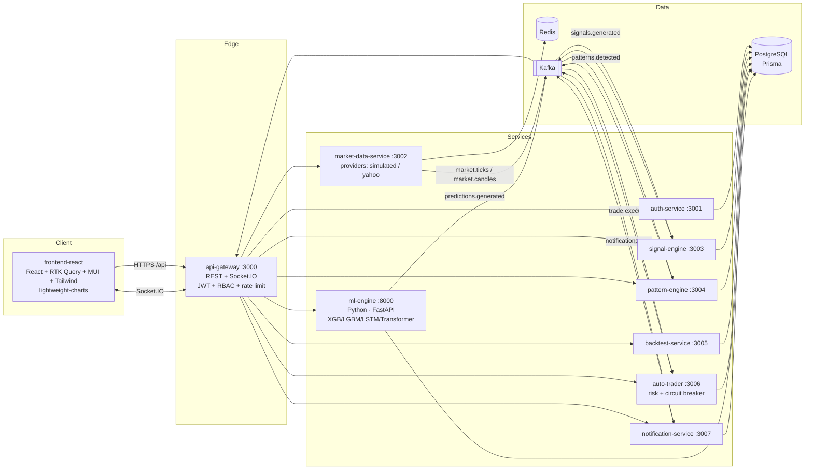
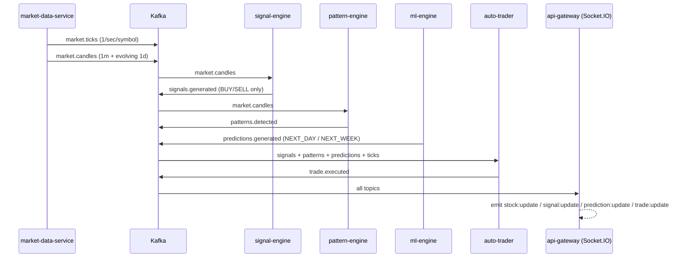

# StockPred — Indian Stock Market AI Trading Platform

/remember realtime-all-stocks-impl

A production-grade, event-driven monorepo for NSE/BSE market analytics: live
market data, rule-based trading signals, chart-pattern recognition, ML
direction prediction (XGBoost + LightGBM + LSTM + Transformer ensemble),
backtesting, and a risk-managed paper-trading engine.

> **This is not investment advice.** Predictions are probabilistic. There is
> no guarantee of profits. Paper trading is enabled by default; live trading
> requires explicit broker authorization. All trading decisions are logged in
> `audit_logs`.

---

## Architecture



### Event flow (Kafka topics)



---

## Monorepo layout

```
apps/
  frontend-react/        React 18 + TS + Redux Toolkit + RTK Query + MUI + Tailwind
  api-gateway/           NestJS — REST aggregation, Socket.IO bridge, JWT/RBAC, helmet, throttling
  auth-service/          NestJS — register/login, refresh-token rotation, RBAC, audit logs
  market-data-service/   NestJS — provider adapters, tick feed, candle aggregation, indicators
  signal-engine/         NestJS — spec BUY/SELL rules over the shared rule core
  pattern-engine/        NestJS — 9 chart-pattern detectors (swing-point geometry)
  backtest-service/      NestJS — 1/3/5/10y replay through the same rule core + CLI
  auto-trader/           NestJS — paper trading, 1%/3%/8% risk limits, circuit breaker
  notification-service/  NestJS — persists + delivers notifications
  ml-engine/             Python — features, 4 models, 40/25/20/15 ensemble, FastAPI
packages/
  shared-types/          Domain enums + interfaces (single source of truth)
  shared-utils/          Indicators, S/R engine, signal rule core, metrics, risk sizing
  shared-events/         Kafka topics, event envelopes, kafkajs wrappers
  database/              Prisma schema, migrations, seed (stocks + demo users)
infrastructure/
  docker/                Multi-stage Dockerfiles (node, frontend+nginx, ml)
  kubernetes/            Namespace, config, data services (dev), apps, ingress, HPA
  github-actions/        Pipeline documentation (live workflow in .github/workflows)
ml/                      Spec command wrappers (train.py / predict.py)
scripts/                 start-platform.sh / stop-platform.sh / restart-platform.sh
```

---

## Quick start

```bash
cp .env.example .env          # adjust secrets for anything non-local
npm install
npm run start:all             # Docker: postgres + redis + kafka + migrate + seed + all services
# Frontend:    http://localhost:8080
# API gateway: http://localhost:3000
```

Local development (hybrid — infra in Docker, services on the host):

```bash
docker compose up -d postgres redis kafka
set KAFKA_BROKERS=localhost:29092   # host port of the EXTERNAL Kafka listener
npm run build
npm run prisma:migrate && npm run prisma:seed
node apps/market-data-service/dist/main.js   # then the other services
npm run dev -w @stockpred/frontend-react     # http://localhost:5173
```

ML models (required for `/api/predictions/:symbol`):

```bash
pip install -r apps/ml-engine/requirements.txt
npm run train:ml -- --synthetic     # offline deterministic training
npm run predict -- RELIANCE TCS
```

Backtesting:

```bash
npm run backtest -- --symbol RELIANCE --years 3
# or POST /api/backtest {"symbol":"RELIANCE","years":3} (authenticated)
```

Demo users (seeded, local only): `admin@stockpred.local` / `Admin@12345`,
`trader@stockpred.local` / `Trader@12345`, `viewer@stockpred.local` / `Viewer@12345`.

Tests:

```bash
npm test                                   # all jest suites
npm run test:coverage -w @stockpred/shared-utils   # 80% gate on the rule core
python -m pytest                           # in apps/ml-engine
npm run e2e                                # Cypress (platform must be running)
```

---

## Signal engine (spec rules)

BUY requires the mandatory core **EMA20 > EMA50 AND MACD bullish**, then a
weighted score ≥ 70 across: EMA50 > EMA200, RSI 45–70, volume above 20-bar
average, proximity to support (≤3%), and a confirmed 20-bar breakout.
SELL mirrors it: MACD bearish AND (EMA20 < EMA50 OR RSI > 75), plus
resistance proximity and breakdown confirmation. HOLD is never published —
only actionable signals reach `signals.generated`.

Targets/stops are ATR-derived (1.5×ATR stop, snapped under nearby support;
target = 2× risk, capped at overhead resistance), so every signal carries an
explicit risk:reward.

## Auto trading (compliance defaults)

- **PAPER mode by default.** LIVE requires `TRADING_MODE=LIVE`,
  `LIVE_TRADING_ENABLED=true`, **and** an authorized broker row — and still
  refuses until a real broker adapter is wired in.
- Auto-buy gate: BUY signal with confidence > 85, pattern confidence > 80,
  risk:reward ≥ 1:2.
- Auto-sell: target hit, stop-loss hit, reversal signal, bearish ML prediction.
- Risk: 1% capital per trade, 3% daily / 8% weekly drawdown circuit breaker
  (auto-resets next period; admin reset endpoint is audited).

## ML engine

22 features per bar (OHLCV-derived, RSI/MACD/ATR/EMA/VWAP/Bollinger, Nifty +
Midcap trend, India VIX, sector strength, news/earnings sentiment stubs) feed
four models — XGBoost (40%), LightGBM (25%), LSTM (20%), Transformer (15%) —
whose soft-voted ensemble classifies UP / DOWN / SIDEWAYS for next-day and
next-week horizons. `expectedMove` comes from per-class median |forward
return| measured at training time.

---

## Architectural decisions

| Decision                                          | Rationale                                                                                                                                                                                                                                                                   |
| ------------------------------------------------- | --------------------------------------------------------------------------------------------------------------------------------------------------------------------------------------------------------------------------------------------------------------------------- |
| **npm workspaces, no extra orchestrator**         | Smallest tool surface that still gives one lockfile, hoisting, and per-package builds; turborepo/Nx can be layered on later without restructuring.                                                                                                                          |
| **Shared signal rule core in `shared-utils`**     | The backtester replays history through _literally the same function_ the live engine runs — eliminating live/backtest rule drift, the classic quant bug.                                                                                                                    |
| **Pluggable market-data providers**               | Real NSE/BSE feeds need licensed broker APIs (Zerodha/Upstox). The hexagonal `MarketDataProvider` port ships with a deterministic simulator (offline dev, reproducible tests) and a Yahoo Finance historical adapter; a broker adapter drops in without touching consumers. |
| **`lightweight-charts` for the chart module**     | TradingView's full charting library requires a license; their open-source lightweight-charts delivers candlesticks, volume, price lines and markers with the same visual language.                                                                                          |
| **PyTorch as the single DL runtime**              | Shipping TF + Torch doubles the ML image for zero functional gain; LSTM/Transformer are framework-portable if TF is ever mandated.                                                                                                                                          |
| **ml-engine writes its own predictions**          | The ML service owns its domain (DDD); it persists via asyncpg into the Prisma-migrated table and emits envelope-compatible Kafka events, instead of round-tripping through a Node service.                                                                                  |
| **Graceful degradation everywhere**               | Every service tolerates Kafka/Redis/Postgres outages (REST-polling fallbacks, best-effort caching/persistence) — the platform boots in any partial environment, and CI exploits this to run e2e without Kafka.                                                              |
| **Per-service Nest apps with plain `tsc` builds** | No webpack/nest-cli layer; faster builds, smaller images, and `dist/main.js` is the entire runtime contract.                                                                                                                                                                |
| **`packages/database` beyond the spec'd three**   | One Prisma schema shared by seven services needs a single owner; spreading it across services would fork migrations.                                                                                                                                                        |
| **bcryptjs over native bcrypt**                   | Zero native-build dependencies keeps Windows/Alpine installs deterministic; at 10 rounds the JS implementation is fast enough for auth workloads.                                                                                                                           |
| **Kafka KRaft single node (dev)**                 | Zookeeper-free single-broker for compose/k8s dev; production should use a managed cluster (MSK/Confluent) — manifests note this.                                                                                                                                            |

## Security

JWT access (15 min) + rotating refresh tokens (7 d, stored hashed, revocable);
RBAC (ADMIN > TRADER > VIEWER) enforced at the gateway; helmet on every HTTP
surface; global rate limiting (120 req/min); class-validator DTO validation;
secrets only via environment; non-root containers; audit logging of auth and
trading decisions; `npm audit` + Trivy gates in CI.

## CI/CD

Nine-stage GitHub Actions pipeline (install → lint → unit → integration →
Cypress → build → docker build → security scan → deploy) — fails on test
failures, on <80% coverage of the rule core, or on critical vulnerabilities.
The deploy job is environment-protected and runs only on `main`.
